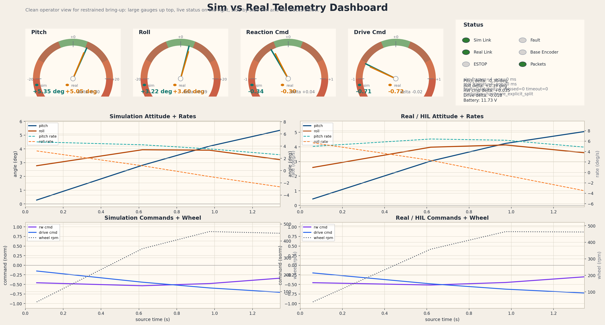
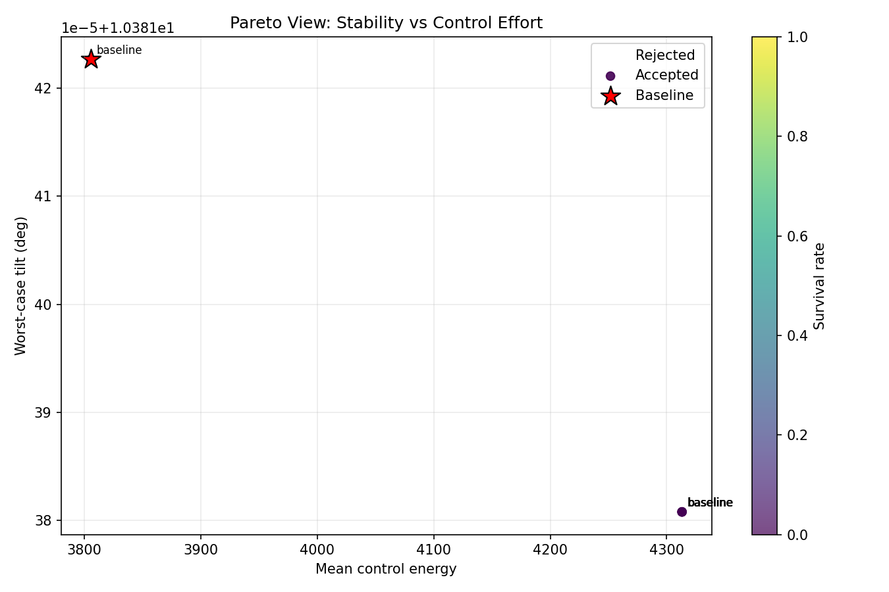
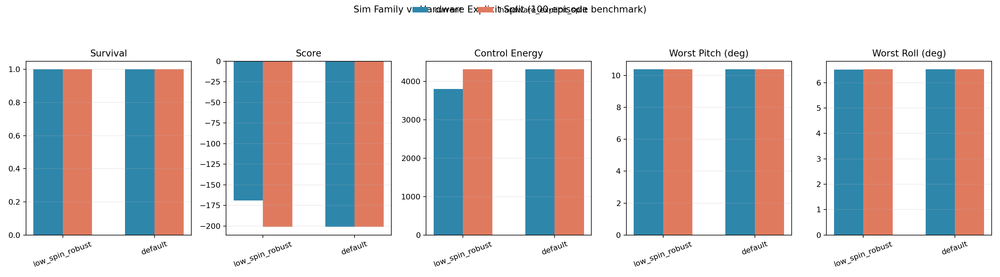

# Reaction Wheel Balancer Sim-to-Real

This repository is the sim-to-real bring-up package for a reaction-wheel balancer with a driven base wheel.

The intended real robot architecture is:

- base wheel corrects pitch
- reaction wheel corrects roll
- ESP32 handles sensors, motor output, telemetry, and safety
- the PC-side stack stays available for live HIL tuning and dyno-style mapping

The point of this repo is not just to "flash firmware." It is to make first power-on practical:

- verify wiring and signs
- verify which control channel drives which motor
- verify ESTOP and timeout behavior
- save a mapping profile
- then tune the real robot toward the MuJoCo behavior

## Hardware Target

This package was prepared around the following build direction:

- `ESP32-WROOM` dev board
- `BMI088` IMU
- `AS5600` magnetic encoder on the reaction wheel BLDC
- `2804` hollow-shaft BLDC with `DRV8313`-class 3PWM driver board
- `110 RPM` geared base motor with `BTS7960` H-bridge
- `3S Li-Po 11.1 V 1500 mAh 25C`
- `12 V -> 5 V` buck converter for logic power

## Repository Layout

- `final/`
  - MuJoCo runtime/controller/export stack
  - HIL bridge
  - synthetic plug-and-play smoke tester
  - mapping profile and workflow docs
- `esp32_rw_base_platformio/`
  - PlatformIO firmware scaffold for the ESP32 rig
  - sensor readout, WiFi telemetry, motor output, and onboard conservative mode

## Current Status

What is already in place:

- real-time synthetic HIL smoke testing for plug-and-play bring-up
- live mapping profile support in the bridge
- timeout and tilt ESTOP behavior
- PlatformIO firmware scaffold for the ESP32 rig
- telemetry comparison tooling for sim vs HIL logs
- explicit split controller path for real hardware
- optional base-encoder telemetry path for later outer-loop upgrades

What the current stack proves:

- the transport layer works
- the dyno-style mapping workflow exists
- the safety layer is usable for restrained bring-up
- the runtime split controller now enforces the intended actuator roles
- restrained bring-up can run in IMU-only mode without a base wheel encoder

Current limitation:

- the explicit split controller is for correct hardware architecture and safe bring-up, not for beating the richer sim-oriented controller on every benchmark mode
- the base encoder is still recommended later for position hold, drift suppression, and trajectory tracking

## Install

Python dependencies:

```powershell
python -m pip install -r requirements.txt
```

Recommended extras:

- PlatformIO for ESP32 builds
- VS Code with PlatformIO extension

## Quick Start

### 1. PC-side synthetic bring-up

Run the real-time synthetic smoke test:

```powershell
python final/hil_plug_play_smoke.py --bridge-backend stub
```

Run the runtime-backed smoke test:

```powershell
python final/hil_plug_play_smoke.py --bridge-backend runtime
```

This checks:

- idle
- pitch forward
- pitch backward
- roll right
- roll left
- tilt ESTOP
- packet timeout ESTOP

### 2. Live bridge for hardware

Start the bridge with a mapping profile:

```powershell
python final/hil_bridge.py --esp32-ip <ESP32_IP> --mapping-profile final/hardware_mapping_template.json --save-mapping-profile final/results/live_map_session.json --plot
```

This is the main dyno-style workflow. You bring the robot up physically restrained, observe telemetry, and adjust mapping values in real time.

### 2.5. Cleaner dashboard for live sim vs real

The new operator dashboard is a separate live view with:

- bigger dual-value gauges
- status lights for link, ESTOP, faults, encoder state, and packet health
- side-by-side traces for simulation and real/HIL telemetry

Run it with the bridge dashboard mirror enabled:

```powershell
python final/sim_real_dashboard.py --sim-udp-port 9871 --real-udp-port 9872
python final/hil_bridge.py --esp32-ip <ESP32_IP> --dashboard-telemetry --dashboard-port 9872
```

Or launch the full stack in one command:

```powershell
python final/play_everything.py --ui dashboard --with-hil --no-hil-plot --esp32-ip <ESP32_IP>
```

Preview:



### 3. ESP32 firmware

The ESP32 project lives in:

```text
esp32_rw_base_platformio/
```

Read:

- `esp32_rw_base_platformio/README.md`

Typical flow:

```powershell
cd esp32_rw_base_platformio
pio run -t upload
```

## Encoder Reality

You do not need a base wheel encoder for the inner balance loop.

The current hardware split is:

- pitch angle and pitch rate from the IMU drive the base wheel
- roll angle and roll rate drive the reaction wheel

That is enough for restrained balance bring-up and actuator validation. Without a base encoder, the robot can still balance, but it will drift over time because there is no outer loop correcting wheel position.

The base encoder becomes useful later for:

- holding ground position
- reducing long-term creep
- tracking trajectories
- improving sim-to-real parity for the full state-space controller

## Mapping Workflow

The mapping layer is the set of values you adjust during restrained bench bring-up so the hardware behaves like the simulation.

Main mapping knobs:

- `reaction_sign`
- `drive_sign`
- `pitch_rate_sign`
- `roll_rate_sign`
- `reaction_speed_sign`
- `accel_x_sign`
- `accel_y_sign`
- `accel_z_sign`
- `rw_cmd_scale`
- `drive_cmd_scale`
- `pitch_estop_deg`
- `roll_estop_deg`
- `comm_estop_s`

Supporting docs:

- `final/DYNO_MAPPING_WORKFLOW.md`
- `final/HIL_PLUG_AND_PLAY_MATRIX.md`

## Latest Benchmark

Date: `2026-03-08`

Benchmark run:

- `100` episodes
- profile: `fast_pr`
- controller families: `current`, `hardware_explicit_split`
- compare modes: `default-vs-low-spin-robust`

Artifacts:

- `artifacts/benchmark_20260308_152510.csv`
- `artifacts/benchmark_20260308_152510_pareto.png`
- `artifacts/benchmark_20260308_152510_summary.txt`
- `artifacts/sim_vs_hardware_explicit_split_100ep.png`

Plots:





High-level result:

- both controller families survived all `100/100` nominal episodes
- `hardware_explicit_split` now matches the intended real actuator architecture
- `current` still scores better in `low_spin_robust`, which is expected because it is the richer sim-oriented family
- `hardware_explicit_split` is the right branch for restrained sim-to-real bring-up and live mapping

GPU note:

- the machine has an NVIDIA GPU, but the MuJoCo/control benchmark path used here is CPU-bound
- the benchmark was still run end-to-end; there was no meaningful CUDA acceleration path to enable for this workflow

## Practical Bring-Up Order

1. Power the robot with the motors restrained or wheels lifted.
2. Start the PC HIL bridge first.
3. Verify the IMU signs at idle.
4. Verify roll commands go to the reaction wheel.
5. Verify pitch commands go to the base wheel.
6. Confirm large tilt forces ESTOP and zero outputs.
7. Confirm packet loss forces timeout ESTOP.
8. Save the mapping profile.
9. Only then start matching the real response to MuJoCo.

## Important Engineering Note

The remaining engineering gap is no longer basic actuator split.

That part is now explicit:

- pitch goes to the base wheel
- roll goes to the reaction wheel

The remaining work is higher-order tuning:

- live gain mapping against the real hardware
- deciding how much of the richer MuJoCo controller should be preserved for onboard use
- adding the optional base encoder outer loop when you want less drift and better position behavior

## Files To Read First

- `README.md`
- `final/hil_bridge.py`
- `final/hil_plug_play_smoke.py`
- `final/hardware_mapping_template.json`
- `final/DYNO_MAPPING_WORKFLOW.md`
- `final/HIL_PLUG_AND_PLAY_MATRIX.md`
- `esp32_rw_base_platformio/README.md`
